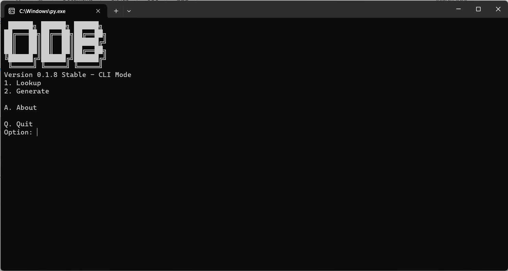

```
                                     ██████╗ ██████╗ ██████╗
                                    ██╔═══██╗██╔══██╗██╔══██╗
                                    ██║   ██║██║  ██║██████╔╝
                                    ██║   ██║██║  ██║██╔══██╗
                                    ╚██████╔╝██████╔╝██████╔╝
                                     ╚═════╝ ╚═════╝ ╚═════╝                
```

<h4 align="center">Apple Model Identity Lookup tool</h4>
<h4 align="center">Support Windows and macOS</h4>

<p align="center">


<p align="center">
  <a href="#feature">Feature</a>
  •
  <a href="#installation">Installation</a>
  •
  <a href="#todo">ToDo</a> 
  •
  <a href="#preview">Preview</a>   
</p>

# Feature
- Gen SMBios (powered by [GenSMBios](https://github.com/corpnewt/GenSMBIOS/))
- Gen ApECID
- Apple Model Indentity Lookup
- CFU (Check For Updates)

# Installation

1. Download [requirements.txt](ODB/requirements.txt) then run 
```
pip install -r [requirements.txt path]
```
or (in macOS)
```
pip3 install -r [requirements.txt path]
```
## In Windows
 1. Click to py file
## In macOS
 1. Open Terminal
 2. Run
```
python3 [ODB.py path]
```
Make sure you have Python installed and a good internet connection!
# ToDo
<a href="TODO.md">TODO</a> 
# Preview

<p align="center"></p>

# Special thanks to:

- [corpnewt](https://github.com/corpnewt) for [GenSMBios](https://github.com/corpnewt/GenSMBIOS/) source code
